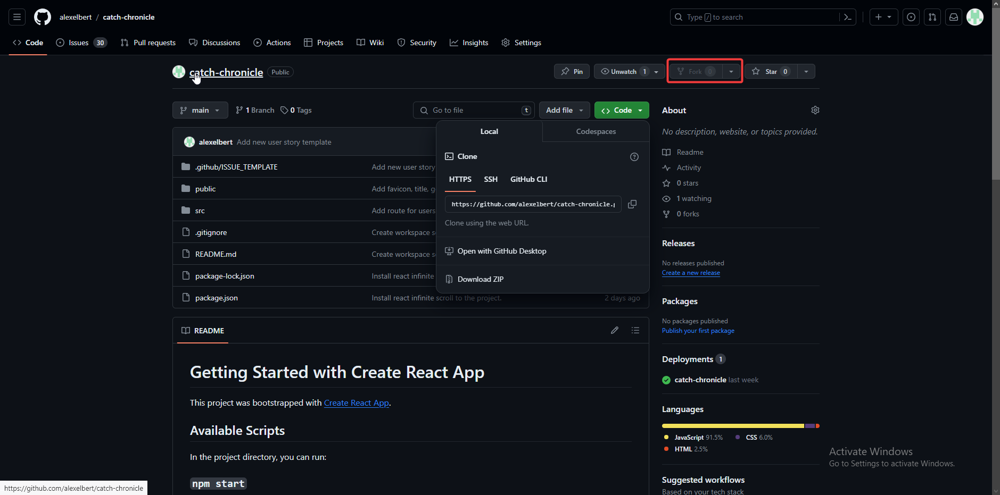

# Catch Chronicle: Fish, Share and Connect 🎣

**Catch Chronicle** is a social media app dedicated to logging and sharing catches.

Simple joy of fishing moments often goes overlooked, unless it's something extraordinary. **Catch Chronicle** urges you to embrace those everyday catches and celebrate the moments that matter with others.
Whether you're reeling in a big fish on a serene lake or capturing the laughter of your loved ones during a family gathering, log your catches and share these cherished memories with your fellow anglers and friends.

**Key features:**

- **User Accounts & Profiles**: Create an account and customize your profile.
- **Log Catches with Geolocation**: Share your catches and location data.
- **Search for Catches**: Find catches by title or user.
- **User Interactions**: Like and comment on catches, follow users you like.
- **Notifications**: Get notifications when other users like your catch, follow you or comment on one of your catches. 

Deployed application can be found here: [Catch Chronicle](https://catch-chronicle-61d760d135f4.herokuapp.com)

# Table of Contents
- [Catch Chronicle: Fish, Share and Connect 🎣](#catch-chronicle-fish-share-and-connect-)
- [Table of Contents](#table-of-contents)
  - [Project Goals](#project-goals)
  - [Features](#features)
    - [Existing Features](#existing-features)
      - [User Authentication](#user-authentication)
      - [User Profiles](#user-profiles)
      - [Add Catch](#add-catch)
      - [Editing and Deleting Catches](#editing-and-deleting-catches)
      - [Comments and Likes](#comments-and-likes)
      - [My Catches](#my-catches)
      - [Reusable Components](#reusable-components)
      - [Future Features](#future-features)
  - [Design](#design)
    - [Strategy Plane](#strategy-plane)
    - [Scope Plane](#scope-plane)
    - [Structure Plane](#structure-plane)
    - [Skeleton Plane](#skeleton-plane)
    - [Surface Plane](#surface-plane)
      - [Logo](#logo)
      - [Colours](#colours)
      - [Fonts](#fonts)
  - [Technologies Used](#technologies-used)
    - [Frameworks and Languages](#frameworks-and-languages)
    - [Additional JavaScript and React Libraries](#additional-javascript-and-react-libraries)
    - [Other Software](#other-software)
  - [Testing](#testing)
  - [Deployment](#deployment)

## Project Goals

The goal of this project was to build a social media platform in which fishing enthusiast users can log and post their own catches and see other users catches.  

## Features

### Existing Features

- **User authentication and profiles**: Users can create an account, log in and log out. They can customize their profile by adding a profile picture, bio, location, name and other social media platforms.
- **Logging catches with geolocation**: Users can log catches and location data. They can also edit and delete their catches.
- **Catches list view with infinite scroll**: Users can see lists of catches (all catches, catches by followed users, liked catches). For better performance and user experience, the lists are paginated, and additional catches are loaded as the user scrolls towards the bottom of the page.
- **Catches search**: Users can search for catches by title or user.
- **User interactions**: Users can like and comment on catches and follow other users.

#### User Authentication

- Signed-out users can see a list of all catches and search for catches. To use the other features of the app, an account creation is required and sign in.

- Signed in users can access their feed, their liked catches.
- Users can also log catches by clicking on the add catch link in the navigation bar.

#### User Profiles

- Signed-in users can click on their username in the top navigation bar to access their profile.
- Users can edit their profile by clicking on the three dots in the top-right corner of the profile page.
- Also, change their username and password by clicking on the corresponding options on their profile page dropdown menu.
- Users can follow other users by clicking on the Follow button on their profile page or in the *Popular profiles* widget.

#### Add Catch

- Users can add catches by clicking on the add catch link in the navigation bar.
- On the add catch page, users can add a catch. Users can add a caption, image, species, weight, length, lure, location data to their catch.
- Location data can be added automatically if the user grants the application access to their current location. Alternatively, users can type in location on their own.
- After submitting the form, the user will be redirected to the catch detail page, which can also be accessed by clicking on a catch.

#### Editing and Deleting Catches

- Users can edit and delete their catches by clicking on the dropdown menu indicated by three dots on the catch detail page.

#### Comments and Likes

- Signed-in users can comment on sounds by submitting the comment form on the sound detail page.
- New comments will appear underneath the catch detail and can be edited or deleted by clicking on the dots in the comment dropdown menu.
- The number of comments will appear underneath the catches details.
- Users can like catches by clicking on the thumbs up icon on the catch detail page.

#### My Catches

- Users can see a table of all their catches and information filtered so that the most recent catch is showing first

#### Reusable Components
- **Asset** component that's function is an asset e.g image along with optional features like a loading spinner.
- **Avatar** component displaying a avatar image along with text that is optional, can also customize source and height.
- **MoreDropdown** component used for creating different dropdown menus, both profile related and generic use for editing e.g.
- **NavBar** component that is reusable with a user friendly interface that includes conditional rendering depending on the users authentication status.
- **NotFound** component, renders not found message when user tries and access page that does not exist.
- **Button** component used for buttons across the website with a cohering styling and adaptable usage.
- **MyCatchesChart** component  displays a line chart showing the number of catches a user has made each month. It takes a list of catches (myCatches) as a prop, which includes dates when each catch was made. When the component mounts or updates, it calculates how many catches were made in each month and then updates the chart data to display this. This component uses useState for managing chart data and useEffect for recalculating this data whenever the list of catches changes, ensuring the chart always reflects the latest information.
- **NotificationsComponent** is designed to handle user notifications in an interactive and user-friendly manner. Upon mounting, it initiates a process to fetch notifications for the user, displaying a loading state until the notifications are retrieved successfully. The central feature of this component is a bell icon that, when clicked, reveals a modal window. This modal displays all the notifications that have been fetched. Each notification is presented with its content and creation time, and users have the option to remove any notification directly from this interface.

The component have a dynamic notification count indicator: a small dot appears on the bell icon if there are unread notifications, providing a visual cue to the user that there are new notifications. The process of fetching and displaying notifications is managed through asynchronous operations, making sure that the user interface remains responsive and up to date. In case there are no notifications, the component informs the user that there are no new notifications.

#### Future Features

The following features has not been included in the current scope of the project but would like to add in the future:
- Implement weather details fetched from location and added on to catch data.
- Add on capability for generating detailed graphs/diagram to be able to draw some conclusions of their fishing results.

## Design

Focus for the design was from a user centred perspective, following the five planes of UX. The design of the front end part of the project had to go well together with the backend part.

### Strategy Plane

**Catch Chronicle** is a social media application dedicated to sharing your catches with other enthusiasts who has an interest in fishing and would like to connect with others or just perhaps boast about a priced catch. Main goal is to have an easy way of storing your catches and share with friends and followers your catches during a fishing trip, while interacting with other enthusiasts in a fun way.

Using coordinated through geolocation is a good way for a user to find out about potential fishing spots or just have a really good reference in case you have forgotten where you had a good fishing experience so that you can come back to that same spot.

Just having a good reference of all your catches can give you a clear picture of how your fishing has been and you could perhaps start seeing patterns of better conditions depending on weather or what type of lure you are using.

The social interaction feature allows you to follow, liking and commenting on other users catches and encourages you to engage with people with a common interest.

### Scope Plane

For the scope of the project separate sets of user stories was created for backend and frontend.

### Structure Plane

The planning of the project revolved around thinking about the frontend early since the backend (DB, models, API endpoints) since it had to be done before to match what was wanted in the frontend.

### Skeleton Plane

Layout of the application is with a mobile-first mindset since main use is intended for using on the go. Design is fully responsive and can be used on all screen sizes.

The user interface can be diverted into three main sections:
- Navigation bar with the following:
  - Catch Chronicle logo and title
  - Sign-up and sign-in links for signed-out users
  - Add Catch link to log a catch
  - Feed link to see catches users you are following have made
  - Liked link to see your favourite catches that you have liked
  - My Catches link to get a table of all your catches filtered to have your latest catch first
- Content Section displaying the content of the current page

Wireframes for desktop

### Surface Plane

#### Logo

For the surface plane was the first thing was to design a logo for the website two fish outlines. It was important to keep it simple so it would look good in small sizes and that it could also be used as a favicon. I used black and grey for a minimalistic look.

#### Colours

I choose to use a pallet of different shades of greens for a mellow and nature inspired feel for buttons and other colour elements.

#### Fonts

I chose Open Sans as the main font for the application for its clean look and good legibility throughout the website. 

To differentiate the application name from the rest I chose to use Patua One slab serif text type that works well use din small sizes and has a chunky and friendly appearance. 

## Technologies Used

### Frameworks and Languages

The application is built with [React](https://reactjs.org/), which is a frontend JavaScript library. The project was initiated with [Create React App](https://create-react-app.dev/).

### Additional JavaScript and React Libraries

- [Axios](https://axios-http.com/) for making HTTP requests to the API.
- [Bootstrap](https://getbootstrap.com/) and [React Bootstrap](https://react-bootstrap.github.io/) for layout and styling.
- [React Router](https://reactrouter.com/en/main) for routing.
- [React Infinite Scroll Component](https://www.npmjs.com/package/react-infinite-scroll-component) for infinite scroll.
- [JWT Decode](https://www.npmjs.com/package/jwt-decode) for JSON Web Tokens.
- [Jest](https://jestjs.io/) and [React Testing Library](https://testing-library.com/docs/react-testing-library/intro/) for automated testing.
- [Chart.js](https://www.chartjs.org/docs/latest/charts/line.html) for creating charts displaying a users monthly catches.

All used third party libraries contribute important features to the application. Axios stand out in particular for their essential role in the project: Axios for providing the connection between the frontend and the backend part of the project.

### Other Software

- [GitHub](https://github.com/) is used to store all project files in the [repository](https://github.com/alexelbert/catch-chronicle)
- [Heroku](https://heroku.com/) is used to deployment.
- [Visual Studio Code](https://code.visualstudio.com) was used as code editor.
- [Am I Responsive?](https://ui.dev/amiresponsive?url=https://catch-chronicle-61d760d135f4.herokuapp.com) was used to generate responsive images of website.
- [Chrome Lighthouse](https://developer.chrome.com/docs/lighthouse/) was used for performance test of deployed website.
- [Figma](https://www.figma.com) was used for making wireframes.
- [Geolocation API](https://developer.mozilla.org/en-US/docs/Web/API/Geolocation_API) used to determine users location when adding a new catch to autofill latitude and longitude fields.
- [LocationIQ](https://locationiq.com) used for fetching users location based of geolocation data (latitude and longitude).

## Testing

All Testing procedures for the application have been documented here: [Testing Documentation](/docs/TESTING.md)

## Deployment

The application was deployed to [Heroku](https://heroku.com). The Applications live version can be found at https://catch-chronicle-61d760d135f4.herokuapp.com.

Please follow these steps for deployment of the application:

1. Deploy your own version of the [Catch Chronicle API](https://github.com/alexelbert/catch-chronicle-api) by following the [deployment instructions for the Catch Chronicle API](https://github.com/alexelbert/catch-chronicle-api#deployment).

2. Clone or fork this repository. For forking it, go to https://github.com/alexelbert/catch-chronicle, click on `Fork` and follow the instructions. For cloning the repository, run `git clone https://github.com/alexelbert/catch-chronicle.git` in your terminal.

 
    

    

3. Go to the repository folder and edit the file `src/api/axiosDefaults.js`. In the file, change the value of `axios.defaults.baseURL` to the URL of your own deployed API. You can find the URL by accessing your API app from Herokus dashboard and then copying the URL from the `Open app` button.

4. If you don't have a API app yet, login to [Heroku](https://heroku.com). Then start a new app from the [Heroku dashboard](https://dashboard.heroku.com) by clicking on `New` and then on `Create new app`.

    

5. Give your app a name that is available and choose your region based of where you are located.

6. Click on the *Deploy* tab and connect the Heroku app to your GitHub repository.

    

7. Scroll down and select the branch you want to deploy in the *Manual deploy* section. Now click on `Deploy Branch` for the deployment of the application.

    

8.  In case you run into any issues while deploying your App you can access Heroku logs by clicking on `More` and then `View logs` you can also check the *Activity* tab for debugging.

    

9.  After successful deployment, click on `Open app` to open your deployed app.

    

    If everything went ok, you should see the *Catch Chronicle* landing page.

[def]: #catch-chronicle-fish-share-and-connect-